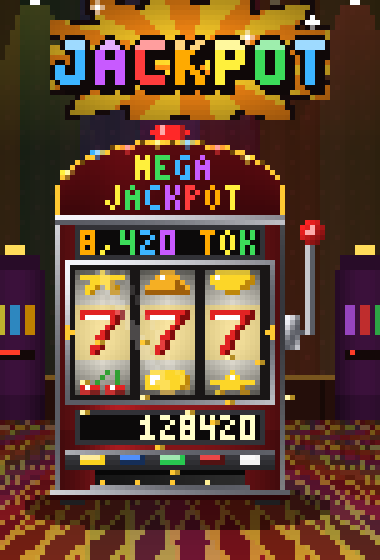
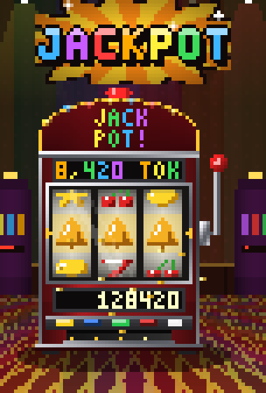
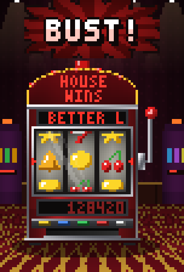
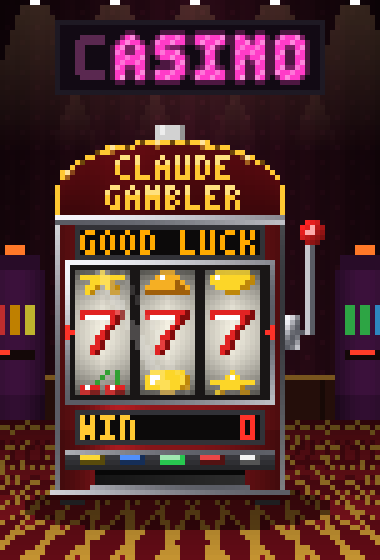
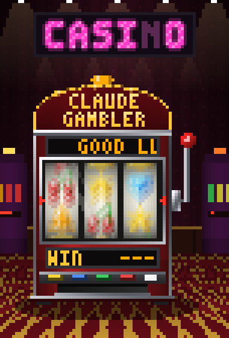

# 🎰 Claude Gambler

> Every prompt pulls the lever. Every finished task hits the JACKPOT.

**Claude Gambler** (`gamble-mode`) is a Claude Code mod that turns waiting for Claude into a slot machine. While Claude works, a pixel-art slot machine spins in a sidebar beside the conversation, standing in its own little casino: wallpapered walls, ceiling lights, a neon sign, neighbouring machines and a patterned carpet. When Claude finishes, the reels land, a comic-book **JACKPOT** sign goes up, and the tokens the turn used are paid out as your winnings.

It is purely an entertainment layer: the reels never change what Claude does.

<p align="center">
  
</p>

## Screenshots

| 🔥 MEGA JACKPOT | 💥 JACKPOT | 💀 BUST |
| :---: | :---: | :---: |
|  |  |  |
| Three sevens: the rarest win. | Any three of a kind. | Claude was interrupted or hit an error. |

| Waiting for a prompt | Reels spinning while Claude works |
| :---: | :---: |
|  |  |

*(Screenshots and the animation are rendered from the mod's own drawing code and scaled up; in the terminal each pixel is half a character cell.)*

---

## How it plays

```
prompt → lever pulled → reels spin while Claude works → Claude finishes
       → reels land one by one → JACKPOT sign → token payout
```

1. **Lever pull.** You send a prompt. The red-ball lever yanks down past its pivot and springs back.
2. **Spinning.** The reels speed up until they blur. Bulbs chase around the arch, the candle light on top blinks amber, and the LED display scrolls `GOOD LUCK * <quip> * <timer>`.
3. **Landing.** When Claude finishes, the reels slow down left to right, each overshooting a little and bouncing back into place.
4. **Payout.**
   - **Win** (the turn finished normally): a rainbow **JACKPOT** burst appears above the machine, every bulb strobes, the payline flashes gold, the WIN meter rolls up to the token count and coins fly out of the tray. A speech bubble delivers the line: *"LOOKS LIKE WE'VE GOT A WINNER!"*
   - **Bust** (you interrupted Claude, or it hit an error): everything turns red, a **BUST!** sign goes up and the display reads `THE HOUSE WINS`.

The sign and the result stay up until your next prompt.

### Outcomes

The result is random on every win; the odds below are per finished task.

| Reels | Chance | Shown as |
| --- | --- | --- |
| 7 7 7 | 6% | 🔥 MEGA JACKPOT |
| 💎 💎 💎 | 8% | 💎 LEGENDARY WIN |
| two matching 7s or 💎s | 12% | 😱 SO CLOSE! (still pays out) |
| any other three of a kind | 74% | 💥 JACKPOT / ✨ BIG WIN |
| mismatched | task interrupted or failed | 💀 BUST, "THE HOUSE WON." |

Bonus badges:

| Badge | When |
| --- | --- |
| 🎩 HIGH ROLLER | the turn used 1,000,000 tokens or more |
| ⚡ SPEEDRUN WIN | the turn finished in under 30 seconds |

### The payout

Winnings are the tokens the prompt used, summed over every model request in the turn and every subagent it ran:

```
winnings = input + cache writes + output + cache reads
```

The line under the machine breaks it down: `in · out · cache · seconds`. Cache reads usually dominate, because every request re-reads the conversation so far, so payouts grow as a session gets longer.

Every win is also added to your **lifetime bankroll**, shown on the machine's PROGRESSIVE sign. The bankroll is kept across sessions.

---

## Commands

There is nothing to type to play: once the mod is loaded, every prompt spins the reels.

| Command | What it does |
| --- | --- |
| `/slot` | Switches the casino off or on (remembered across sessions). Off, the sidebar closes and prompts no longer spin. |
| `/slot <task>` | Switches the casino on if needed and sends `<task>` to Claude as your prompt. |

---

## Installation

The mod is a plain plugin folder. Clone it and load it into any Claude Code session:

```sh
git clone https://github.com/GrzeskoByte/claude-casino.git
claude --plugin-dir ./claude-casino
```

That's it: there is nothing to configure. From then on every prompt you send pulls the lever and opens the slot machine sidebar. Type `/slot` to switch the casino off (and again to switch it back on).

To load it in every session, add the folder to `CLAUDE_CODE_PLUGIN_DIRS` in the `env` block of `~/.claude/settings.json`:

```json
{
  "env": {
    "CLAUDE_CODE_PLUGIN_DIRS": "/path/to/claude-casino"
  }
}
```

### Requirements

- **A recent Claude Code.** The mod is built on Claude Code's function-hook plugin API, which is early access; it was built and tested on Claude Code 2.1.288. On older versions the mod will not load. Run `claude plugin validate ./claude-casino` to check it against yours.
- **A terminal with 24-bit colour.** The machine is drawn with true-colour half-block pixels. Most modern terminals support this (Ghostty, kitty, Alacritty, WezTerm, iTerm2, Windows Terminal).
- **About 78 columns of sidebar width.** The casino scene is 76 × 56 cells. The sidebar asks for 78 columns; a narrower one crops the picture, and a shorter one scrolls. In the fullscreen layout the sidebar docks beside the conversation, otherwise it opens above the prompt.
- **Other surfaces.** The desktop app, VS Code and mobile cannot draw pixel grids, so they get a simple text version of the reels, display and payout.

---

## How it works

The mod is a Claude Code plugin of **function hooks**. Its module registers hooks on engine events and draws a sidebar pane.

| Event | What the mod does |
| --- | --- |
| `session.start` | Registers `/slot`, loads the bankroll and on/off setting, resumes an animation after a hot reload |
| `prompt.submit` | Opens the sidebar on your own prompt, so it is placed at any terminal width |
| `turn.start` | Starts a new game: records the turn, pulls the lever, starts the animation clock |
| `turn.complete` | Adds up the turn's token usage (subagent turns add to the pot); when the main turn ends, decides the outcome and starts the reels stopping |
| `command.run` (`/slot`) | Toggles the casino, or plays a task |
| `ui.render` (`Pane`) | Draws the whole casino scene as one `Raster` element, plus the result text |

**Animation.** A clock ticks every 90 ms and advances a frame counter held in session state. Each frame redraws the pane, and everything on screen (lever angle, reel positions, bulbs, ticker, coins) is computed from the frame number and the game state. Reel motion follows simple physics: quadratic acceleration up to 0.9 symbols a frame, a quadratic ease-out to the landing symbol, then a small overshoot and settle.

**Rendering.** `pixels.ts` is a small framebuffer: each terminal cell is `▀` with the upper pixel as foreground colour and the lower as background, packed into a `Raster`'s base64 cell grid. `machine.ts` draws the scene into it pixel by pixel: the casino backdrop (wall, ceiling light cones, neon sign, background machines, a perspective carpet and the machine's shadow), then the sign, then the machine pasted on top. The reels are lit cylinders: each screen row is mapped onto the drum with `asin`, so symbols squash and darken as they curve away, and a diagonal glass glare is blended over the window. At speed, several samples along the travel direction are averaged for motion blur.

**State.** Session values live in `$.state` (they survive hot reloads): the current game, the frame counter, the bankroll and the on/off flag. The bankroll and the on/off setting are also written to `$.store`, so they persist across sessions.

### Files

```
claude-casino/
├── .claude-plugin/plugin.json   manifest
├── hooks/
│   ├── hooks.json               points Claude Code at register.tsx
│   ├── register.tsx             hooks: game flow, the animation clock, payout, pane layout
│   ├── game.ts                  the game itself: outcomes, reel physics, what each frame shows
│   ├── machine.ts               the casino scene, the slot machine and the JACKPOT / BUST sign
│   └── pixels.ts                framebuffer, Raster packing, 3x5 font, symbol sprites
├── types/index.d.ts             the state contract (PluginState)
├── tests/slot.test.tsx          win, bust and on/off tests
└── docs/                        screenshots and the demo GIF for this README
```

---

## Customising

Most knobs are constants at the top of `hooks/game.ts`:

| Constant | Default | Effect |
| --- | --- | --- |
| `TICK_MS` | `90` | Frame interval; lower is smoother and busier |
| `PULL` | 17 frames | Lever knob offsets per frame of the pull |
| `MIN_SPIN` | `18` | Frames the reels spin at least, even for instant answers |
| `REEL_GAP` | `8` | Frames between each reel landing |
| `COUNT_FRAMES` | `26` | How long the WIN meter takes to roll up |
| `FLASH_FRAMES` | `110` | How long the celebration animates (~10 s) |
| `HIGH_ROLLER` | `1,000,000` | Token threshold for the 🎩 badge |
| `SPEEDRUN_MS` | `30,000` | Time limit for the ⚡ badge |
| `WIN_QUOTES`, `LOSE_QUOTES`, `QUIPS` | | The machine's lines |

The odds live in `settle()` and the reel strips in `STRIPS`, both in `hooks/game.ts`. Colours, layout and sprites are in `hooks/machine.ts` and `hooks/pixels.ts`.

To pay out only fresh tokens rather than including cache reads, drop `g.cache` from the `total` in `settle()`.

---

## Development

```sh
claude plugin validate .   # checks the manifest and hooks module the way the engine loads them
claude plugin test .       # runs tests/*.test.tsx against the engine
tsc -p .                   # type-checks (tsconfig.json is laid by Claude Code on load)
```

Loaded with `--plugin-dir`, the folder is watched: saving a file hot-reloads the mod in the running session. A hook that fails shows a dim line naming `gamble-mode` in the transcript; run `claude --debug` for the full log.

The tests drive the engine with a mocked clock and store: a finished turn that pays out 128,420 tokens and puts up the JACKPOT sign, an interrupted turn that busts, and `/slot` closing the casino.

> The plugin API is early access and may change between Claude Code releases.

---

## Gamble responsibly

No real money, no real odds, no real house: the only thing you can lose here is time spent watching reels. The house always wins anyway.
